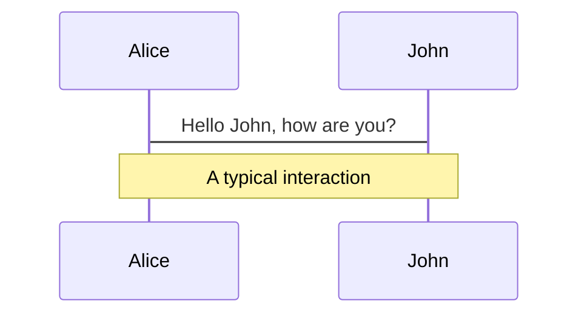
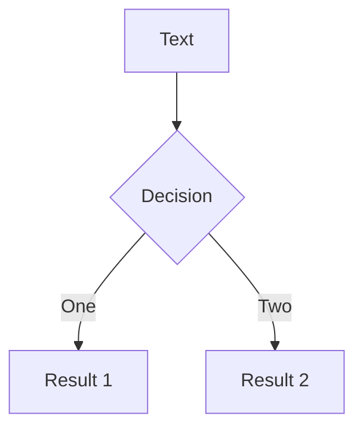
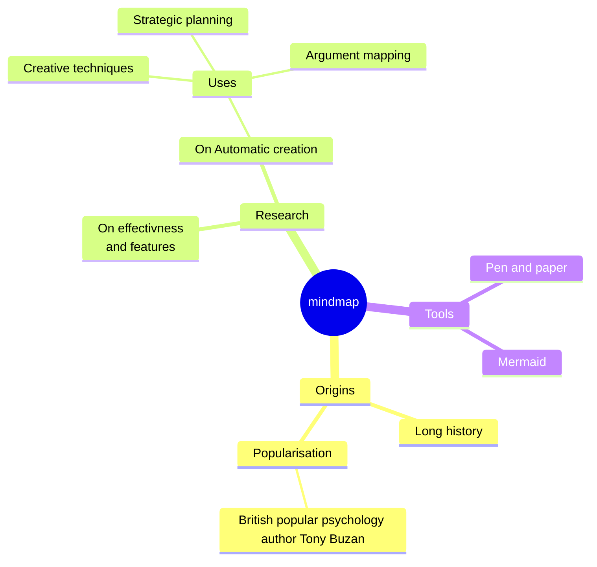
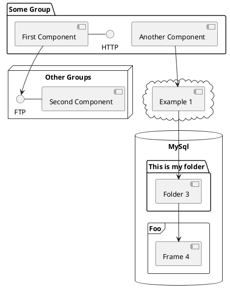

# Welcome to Slidev

Presentation slides for developers

<div class="pt-12">
  <span @click="$slidev.nav.next" class="px-2 py-1 rounded cursor-pointer" hover="bg-white bg-opacity-10">
    Press Space for next page <carbon:arrow-right class="inline"/>
  </span>
</div>

<div class="abs-br m-6 flex gap-2">
  <button @click="$slidev.nav.openInEditor()" title="Open in Editor" class="text-xl slidev-icon-btn opacity-50 !border-none !hover:text-white">
    <carbon:edit />
  </button>
  <a href="https://github.com/slidevjs/slidev" target="_blank" alt="GitHub" title="Open in GitHub"
    class="text-xl slidev-icon-btn opacity-50 !border-none !hover:text-white">
    <carbon-logo-github />
  </a>
</div>

<!--
The last comment block of each slide will be treated as slide notes. It will be visible and editable in Presenter Mode along with the slide. [Read more in the docs](https://sli.dev/guide/syntax.html#notes)
-->

---
transition: fade-out
---

# What is Slidev?

Slidev is a slides maker and presenter designed for developers, consist of the following features

- 📝 **Text-based** - focus on the content with Markdown, and then style them later
- 🎨 **Themable** - theme can be shared and used with npm packages
- 🧑‍💻 **Developer Friendly** - code highlighting, live coding with autocompletion
- 🤹 **Interactive** - embedding Vue components to enhance your expressions
- 🎥 **Recording** - built-in recording and camera view
- 📤 **Portable** - export into PDF, PNGs, or even a hostable SPA
- 🛠 **Hackable** - anything possible on a webpage

<br>
<br>

Read more about [Why Slidev?](https://sli.dev/guide/why)

<!--
You can have `style` tag in markdown to override the style for the current page.
Learn more: https://sli.dev/guide/syntax#embedded-styles
-->

<style>
h1 {
  background-color: #2B90B6;
  background-image: linear-gradient(45deg, #4EC5D4 10%, #146b8c 20%);
  background-size: 100%;
  -webkit-background-clip: text;
  -moz-background-clip: text;
  -webkit-text-fill-color: transparent;
  -moz-text-fill-color: transparent;
}
</style>

<!--
Here is another comment.
-->

---
layout: default
---

# Table of contents

```html
<Toc minDepth="1" maxDepth="1"></Toc>
```

<Toc maxDepth="1"></Toc>

---
transition: slide-up
level: 2
---

# Navigation

Hover on the bottom-left corner to see the navigation's controls panel, [learn more](https://sli.dev/guide/navigation.html)

## Keyboard Shortcuts

|     |     |
| --- | --- |
| <kbd>right</kbd> / <kbd>space</kbd>| next animation or slide |
| <kbd>left</kbd>  / <kbd>shift</kbd><kbd>space</kbd> | previous animation or slide |
| <kbd>up</kbd> | previous slide |
| <kbd>down</kbd> | next slide |

<!-- https://sli.dev/guide/animations.html#click-animations -->

<p v-after class="absolute bottom-23 left-45 opacity-30 transform -rotate-10">Here!</p>

---
layout: image-right
image: https://source.unsplash.com/collection/94734566/1920x1080
---

# Code

Use code snippets and get the highlighting directly![^1]

```ts {all|2|1-6|9|all}
interface User {
  id: number
  firstName: string
  lastName: string
  role: string
}

function updateUser(id: number, update: User) {
  const user = getUser(id)
  const newUser = { ...user, ...update }
  saveUser(id, newUser)
}
```

<arrow v-click="[3, 4]" x1="400" y1="420" x2="230" y2="330" color="#564" width="3" arrowSize="1" />

[^1]: [Learn More](https://sli.dev/guide/syntax.html#line-highlighting)

<style>
.footnotes-sep {
  @apply mt-20 opacity-10;
}
.footnotes {
  @apply text-sm opacity-75;
}
.footnote-backref {
  display: none;
}
</style>

---

# Components

<div grid="~ cols-2 gap-4">
<div>

You can use Vue components directly inside your slides.

We have provided a few built-in components like `<Tweet/>` and `<Youtube/>` that you can use directly. And adding your custom components is also super easy.

```html
<Counter :count="10" />
```

<!-- ./components/Counter.vue -->
<Counter :count="10" m="t-4" />

Check out [the guides](https://sli.dev/builtin/components.html) for more.

</div>
<div>

```html
<Tweet id="1390115482657726468" />
```

<Tweet id="1390115482657726468" scale="0.65" />

</div>
</div>

<!--
Presenter note with **bold**, *italic*, and ~~striked~~ text.

Also, HTML elements are valid:
<div class="flex w-full">
  <span style="flex-grow: 1;">Left content</span>
  <span>Right content</span>
</div>
-->


---
class: px-20
---

# Themes

Slidev comes with powerful theming support. Themes can provide styles, layouts, components, or even configurations for tools. Switching between themes by just **one edit** in your frontmatter:

<div grid="~ cols-2 gap-2" m="t-2">

```yaml
---
theme: default
---
```

```yaml
---
theme: seriph
---
```


</div>

Read more about [How to use a theme](https://sli.dev/themes/use.html) and
check out the [Awesome Themes Gallery](https://sli.dev/themes/gallery.html).

---
preload: false
---

# Animations

Animations are powered by [@vueuse/motion](https://motion.vueuse.org/).

```html
<div
  v-motion
  :initial="{ x: -80 }"
  :enter="{ x: 0 }">
  Slidev
</div>
```

<div class="w-60 relative mt-6">
  <div class="relative w-40 h-40">
    
    
    
  </div>

  <div
    class="text-5xl absolute top-14 left-40 text-[#2B90B6] -z-1"
    v-motion
    :initial="{ x: -80, opacity: 0}"
    :enter="{ x: 0, opacity: 1, transition: { delay: 2000, duration: 1000 } }">
    Slidev
  </div>
</div>

<!-- vue script setup scripts can be directly used in markdown, and will only affects current page -->
<script setup lang="ts">
const final = {
  x: 0,
  y: 0,
  rotate: 0,
  scale: 1,
  transition: {
    type: 'spring',
    damping: 10,
    stiffness: 20,
    mass: 2
  }
}
</script>

<div
  v-motion
  :initial="{ x:35, y: 40, opacity: 0}"
  :enter="{ y: 0, opacity: 1, transition: { delay: 3500 } }">

[Learn More](https://sli.dev/guide/animations.html#motion)

</div>

---

# LaTeX

LaTeX is supported out-of-box powered by [KaTeX](https://katex.org/).

<br>

Inline $\sqrt{3x-1}+(1+x)^2$

Block
$$ {1|3|all}
\begin{array}{c}

\nabla \times \vec{\mathbf{B}} -\, \frac1c\, \frac{\partial\vec{\mathbf{E}}}{\partial t} &
= \frac{4\pi}{c}\vec{\mathbf{j}}    \nabla \cdot \vec{\mathbf{E}} & = 4 \pi \rho \\

\nabla \times \vec{\mathbf{E}}\, +\, \frac1c\, \frac{\partial\vec{\mathbf{B}}}{\partial t} & = \vec{\mathbf{0}} \\

\nabla \cdot \vec{\mathbf{B}} & = 0

\end{array}
$$

<br>

[Learn more](https://sli.dev/guide/syntax#latex)

---

# Diagrams

You can create diagrams / graphs from textual descriptions, directly in your Markdown.

<div class="grid grid-cols-4 gap-5 pt-4 -mb-6">









</div>

[Learn More](https://sli.dev/guide/syntax.html#diagrams)

---
src: ./pages/multiple-entries.md
hide: false
---

---
layout: center
class: text-center
---

# Learn More

[Documentations](https://sli.dev) · [GitHub](https://github.com/slidevjs/slidev) · [Showcases](https://sli.dev/showcases.html)

---

# Installation

```sh
pnpm install prisam -D
pnpm dlx prisma init --datasource-provider sqlite
```

---

# Modeling

data model represent database tables as entities, there is two options in prisma:
  - Interseption: every database table converted to entity, so data models created depend on database, database is the single source of truth, with `npx priisma pull` 
  - Migration: define data model manually then convert them  to database tables through migration, `npx prisma migrate dev --name init`


## modeling entities
```sh
model User {
id Int @id @default(autoincrement()) // @id mean primary_key
email String @unique
name String?
articles Article[]
}

model Article {
id Int @id @default(autoincrement())
titleString
body String?
author User @relation(fields: [authorId], refrences: [id]) // used to connect article to user
authorId Int // register which user rigesterd to
}
```

## model details

body: is field_name
String: is type, common data types are, Int, Float, String, Blob, Json, Unsupported("")
? or []: are modifires
@whatever: are relations, like @id to make it primary ke or @unique or @updatedAt which assign currrent timestamp when update row, or @default() which use functions like autoincrement() for incremental numbers or uuid() for random uuid which is better for security or now() which enter current timestamp, there is alos block level attributes like

```sh
model User {
	name	String	@id @default(uuid())

	@@unique([age, name]) rows with same two fields values should be unique
	@@index([email])
	@@id([name, age]) // remove above id, and use id from these two fields
}
```

## enums

```sh
model User {
	name String
	role	Role	@default(BAISC)
}

enum Role {
	BAISC
	EDITOR
	ADMIN
}
```

---

# Client

>`npx prisma generate` genertae client (run all generators in general), also client is generated by default when migrate db

```js
import { PrismaClient } from '@prisma/client'

// we can specify which operations to log
const prisma = new PrismaClient({ log: ["query", info] })

async function main() {
	// prisma queries go here

	// Create user
	const user = await prisma.user.create({
		data: {
			name: 'John Doe',
			email: 'john@gmail.com'
		}
	})

	// Get all users only
	const users = await prisma.user.findMany()

	// Get all users with articles
	const users = await prisma.user.findMany({
		include: {
			articles: true
		}
	})

	// Create article and associate it with user
	const article = await prisma.article.create({
		data: {
			title: 'John First Article',
			body: 'This is john first article',
			author: {
				connect: {
					id: 1
				}
			}
		}
	})

	// Create user and article and associate them
	const user = await prisma.user.create({
		data: {
			name: 'Sara Smith',
			email: 'sara@gmail.com',
			articles: {
				create: {
					title: 'Saras first article',
					body: 'This is saras first article',
				}
			}
		}
	})

	// Update data
	const user = await prisma.user.update({
		where: { id: 1 },
		data: {
			name: 'John Doe Jr'
		}
	})

	// Remove data
	const article = await prisma.article.delete({
		where: { id: 2 }
	})
}

main()
	.then(async () => {
		await prisma.$disconnect()
	})
	.catch(async (e) => {
		console.error(e)
		await prisam.$disconnect()
		process.exit(1)
	})
```

---

# Prisma Studio

>run server for prisma dashbaord UI

`pnpm dlx prisma studio`

---

# prisma schema editors

- https://drawsql.app/
- https://prisma-editor.vercel.app/
- https://www.prismabuilder.io/
- https://azimutt.app/

---

# Relationships

## one to one: user have one profile and profile have one user

```js
model User {
	id	Int	@id @default(autoincrement())
	email	String	@unique
	profile	Profile?
}

model Profile {
	name	String
	gender	String
	age	String
	
	userId	Int	@unique // it should be @unique coz we want one Profile only reference one User
	user User	@relation(fields: [userId], refrences: [id])
}

// 1. create user then profile
const user = await prisma.user.create({ data: {} })

const profile = await prisma.profile.create({
	data: {
		name: faker.name.firstName,
		userId: user.id
	}
})

// get user data only
prisma.user.findUnique({
	where: { id: user.id },
})

// { id: 1, email: 'test@gmail.com' }

// get use data included profile all props
prisma.user.findUnique({
	where: { id: user.id },
	include: { profile: true }
})

// { id: 1, email: 'test@gmail.com', profile: { name: 'Sabin', age: 10, gender: 'male' } }

// get only spesfic props in profile
prisma.user.findUnique({
	where: { id: user.id },
	include: {
		profile: {
			select: { name: true }
		}
	}
})

// 2. create a user with a profile
const user = await prisma.user.create({
	data: {
		profiel: {
			create: {
				name: faker.name.firstName(),
			}
		}	
	},
	// we can also add include here, its not only for queries
})
```

## one to many: user can have many posts, but post have one author

```js
model User {
	id	Int	@id @default(autoincrement())
	email	String	@unique
	posts	Post[]
}

model Post {
	title	String
	
	userId	Int	// it can be @unique, this mean every post should have id of a user
	user User	@relation(fields: [userId], refrences: [id])
}

// create post
const post = await prisma.post.create({
	data: {
		user: {
			connect: {
				id: user.id
			}
		}
	}
})

prisma.user.findMany({
	include: {
		posts: true
	}
})

// { id: 1, email: 'test@gmail.com', posts: [{ name: 'Post1' }] }
```

## ambigous one to many: some times we have one to maney relation to same table more than one time, in this case we should give these relations names

```sh
model User {
	id	String	@id @default(uuid())
	name	String
	email	String
	isAdmin	Boolean
	preferences	Json
	writtenPosts	Post[]	@relation("WrittenPosts")
	favoritePosts	Post[]	@relation("FavoritePosts")
}

model Post {
	id	String	@id @default(@uuid())
	rating	Float
	createdAt	DataTime	@default(now())
	updatedAt	DateTime	@updatedAt
	
	author	User @relation("WrittenPosts", fields: [authorId], references: [id])
	authorId	String

	favoritedBy	User?	@relation("FavoritePosts", fields: [favoritedById], references: [id])
	favoritedById	String?
}
```

## implicit many to many: many diffrent posts associated with any diffrent tags, normally need intermidiary table

mode, and prisam in this case handle this intermiary table for us (create and name it under the hood)

```sh
model Post {
	id Int	@id @default(autoincrement())
	title	String
	tags Tag[]
}

model Tag {
	id Int	@id @default(autoincrement())
	posts Post[]
}

prisma.post.findMany({
	include: {
		tags: true
	}
})

// { id: 1, title: 'Post1', tags: [{ id: 2 }] }
```

## explicit many to many: use them if you need add other props to relation as `timestamp` or `quantity`, or if you need more flexible queries

```sh
model Post {
	id Int	@id @default(autoincrement())
	title	String
	tags PostTag[]
}

model Tag {
	id Int	@id @default(autoincrement())
	posts PostTag[]
}

model PostTag {
	postId	Int
	post	Post	@relation(fields: [postId], references: [id])

	tagId	Int
	post	Tag	@relation(fields: [tagId], references: [id])

	@@id([postId, tagId])
}

prisma.post.findMany({
	include: {
		tags: true
	}
})

// { id: 1, title: 'Post1', tags: [{ id: 2 }] }
```

## self reference many to many: a category can have a parent category and a parent category can have multiple children

## self relations, nested documents

---

# Filtring

```js
// create 
const user = await prisma.user.create({
	data: {
		name: 'abbas',
		age: 20
		email: 'abbas@example.com'
	},
	// create other row with this
	userPrefrences: {
		create: {
			reciveEmails: true
		}
	},
	// connect created row with this
	profile: {
		connect: {}
	},
	// returned result include only what in data, to include others
	include: {
		userPrefrences: true
		// userPrefrences: { spesficFields: true }
	},
	// another option is select which enable us to exclude also main fields of row, we should use include or select not both
	select: {
		name: true,
		userPrefrences: true
		// userPrefrences: { spesficFields: true }
	}
})

// create many
const user = await prisma.user.create({
	data: [{}, {}]
})

// find many
const user = await prisma.user.findMany({
	where: {
		name: 'kyle'
	},
	distinct: ["name", "age"], // return unique rows depend on these columns 
	take: 2, // how many users we should take
	skip: 1, // how many users to skip
	orderBy: {
		age: "desc"
	}
	// also we can use include or select here
})


// find first, fields not necessary be unique
const user = await prisma.user.findFirst({
	where: {
		name: 'kyle'
	},
	// also we can use include or select here
})

// find one depend on unique attribute
const user = await prisma.user.findUnique({
	where: {
		email: 'kitkat@gmail.com',
		// we can use age_name in this case coz we did a unique constain on both of them
		age_name: {
			age: 27,
			name: 'kyle'
		}
	},
	// also we can use include or select here
})

// advanced where operations
// filter operation
{
	where: {
		name: 'abbas',
		name: { equals: 'abbas' },
		name: { not: 'abbas' },
		name: { in: ['abbas'. 'ali'] },
		name: { notIn: ['abbas'. 'ali'] },
		name: { contains: '@test.com' },
		name: { startWith: '@test.com' },
		name: { endWith: '@test.com' },
		age: { lt: 20 },
		age: { gt: 20 },
		age: { lte: 20 },
	}
}

// condation filtring
{
	where: {
		AND: [
			{ name: { startWith: '@test.com' } },
			{ name: { endWith: '@test.com' } }
		],
		OR: [
			{ name: { startWith: '@test.com' } },
			{ age: { gt: 20 } }
		],
		NOT: { name: { startWith: '@test.com' } },
	}
}

// relationship filtring 
const users = await prisma.user.findMany({
	where: {
		// find users where userPrefs.reciveEmails equal true
		userPrefs: {
			reciveEmails: true
		}
		// or like this which mean, find useres with every userPrefs match 
		userPrefs: {
			// every, some, none, is, isNot
			every: {
				// AND, OR, NOT apply here
				title: 'call prefs'
			}
		}
	}
})

const posts = await prisma.post.findMany({
	where: {
		// find posts which thier authors age is 27
		author: {
			is: { age: 27 }
		}
	}
})
```

## update
there is `update` and `updateMany`, both accept `({ where: {}, data: {} })`, and `updateMany`, it have intersting methods to update like:

```js
const user = await prisma.user.update({
	where: { name: 'rush' },
	data: { 
		// increment, decrement, multiply, divide
		age: { increment: 1 },
		// create or connect or disconnect relations when update
		userPrefs: {
			create: { emailUpdates: true }
		},
		userPrefs: {
			connect: { id: 114 }
		},
		userPrefs: {
			disconnect: true
		}
	},
	//  does'nt accept `select` and `include`
})
```

## delete

work as find, we have `delete` and `deleteMany`

---

# Furthermore

- https://medium.com/yavar/prisma-relations-2ea20c42f616
- https://www.youtube.com/watch?v=yW6HnMUAWNU
- https://www.youtube.com/watch?v=Q7nNbJomC0I
- getting know about normalizing data and denormalizing
- sql relations with update and delete cascades nad queries join
- conceptual er diagram
- apis (with forms specially)
- https://www.prisma.io/ecosystem